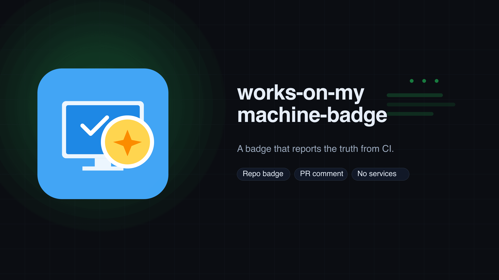
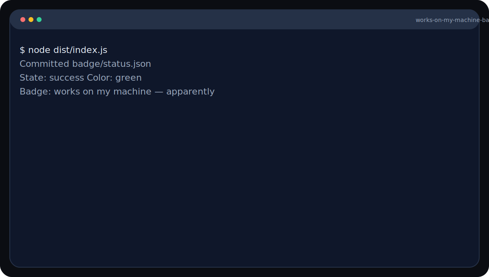

<picture>
  <source srcset="branding/hero.svg" type="image/svg+xml">
  
</picture>

# Works on My Machine Badge
A badge that reports the truth from CI. Repo-only badges that update from real CI results. Generates a shields.io endpoint badge you can embed anywhere.

**Type:** GitHub Action

   

> [!IMPORTANT]
> This action commits to your repo using `GITHUB_TOKEN`. Review workflow permissions before enabling on forks.

## Highlights
- Repo-owned badge updated by your CI workflow.
- Optional PR comments for visibility.
- No external services or tokens.


## Output


Example artifacts live in `examples/`.

Need help? Start with `docs/troubleshooting.md`.

The badge payload format lives in `examples/status.json`.


## Quickstart
```yaml
- name: Update badge status
  permissions:
    contents: write
  uses: PetriLahdelma/works-on-my-machine-badge@v0
  with:
    state: ${{ job.status }}
```


## CI in 60s
```yaml
name: badge
on:
  workflow_run:
    workflows: ["CI"]
    types: [completed]

jobs:
  badge:
    runs-on: ubuntu-latest
    permissions:
      contents: write
    steps:
      - uses: actions/checkout@v4
      - uses: PetriLahdelma/works-on-my-machine-badge@v0
        with:
          state: ${{ github.event.workflow_run.conclusion }}
```

## Permissions
```yaml
permissions:
  contents: write
  pull-requests: write # only if comment-on-pr: true
```
See `docs/fork-prs.md` for fork-safe patterns.

## Status Mapping
| Input | Normalized state | Suggested color |
| --- | --- | --- |
| `success`, `pass` | `pass` | `green` |
| `failure`, `fail`, `error`, `timed_out`, `timed-out` | `fail` | `red` |
| `neutral`, `cancelled`, `canceled`, `skipped` | `neutral` | `lightgrey` |

The action does not auto-pick colors; pass `color` or map it in your workflow.

## Race Conditions
Parallel jobs writing the same `status-file` will overwrite each other. Use per-workflow files or a finalizer job.

## Demo


```text
https://img.shields.io/endpoint?url=https://raw.githubusercontent.com/OWNER/REPO/main/badge/status.json
```


## Compatibility
- Runtime: GitHub Actions (Node 20 on ubuntu-latest).
- OS: Linux in CI; other runners unverified.
- External deps: none.

## Guarantees & Non-Goals
**Guarantees**
- Writes a JSON badge payload to your repo on every run.
- No third-party services; uses GitHub API only.

**Non-Goals**
- Not a status check or multi-job aggregator.
- Does not host the badge image.

## Docs
- [Requirements](docs/requirements.md)
- [Inputs](docs/inputs.md)
- [Output](docs/output.md)
- [Permissions](docs/permissions.md)
- [Status Mapping](docs/status-mapping.md)
- [Fork PRs](docs/fork-prs.md)
- [Troubleshooting](docs/troubleshooting.md)
- [Guarantees & Non-Goals](docs/guarantees.md)
- [Constraints](docs/constraints.md)

More: [docs/README.md](docs/README.md)

## Examples
See `examples/README.md` for inputs and expected outputs.

## Used By
Open a PR to add your org.


## Contributing
See `CONTRIBUTING.md`.

## License

MIT
